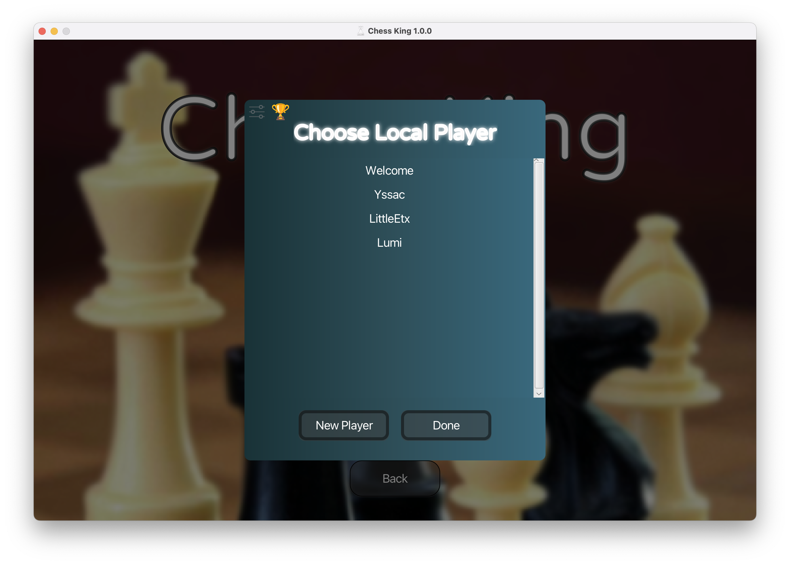
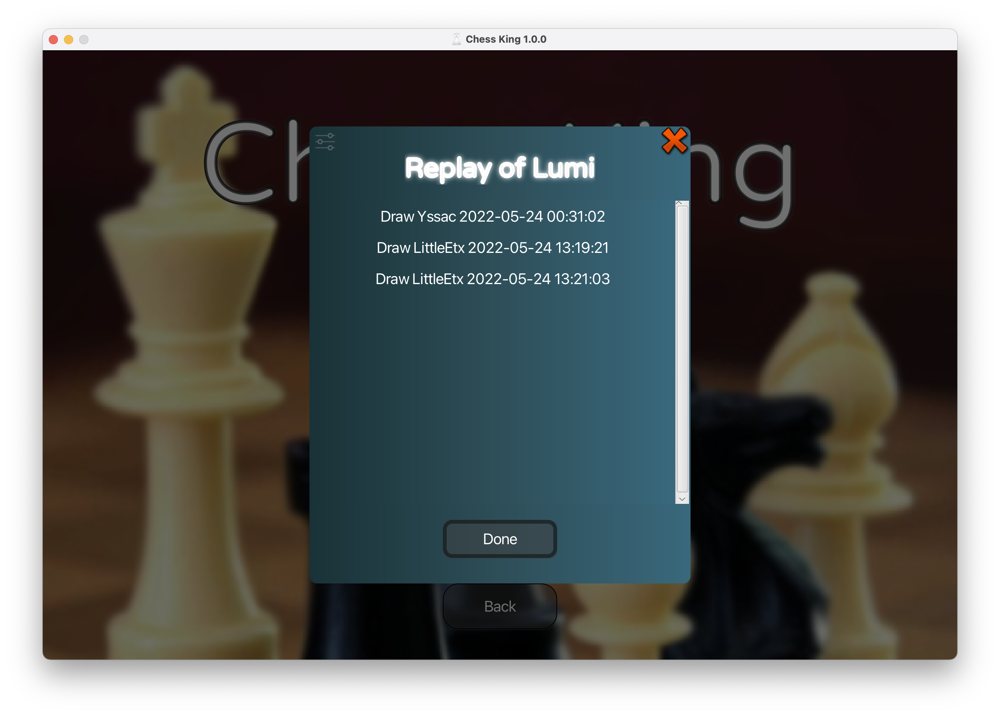

# LittleEtx's Pre

## The Game Engine
### FXGL
Useful database.

### Based on javafx
JavaFX offers full time support for MVC.

MVC (Mode-view-controller) divides the program logic into three interconnected elements. 
It emphasizes on the separation between a software's business logic and display.

Model: the data the app should contain.

View: how the app's data should be displayed.

Controller: the logic that updates the model and/or view in response to input from users.

***
## One Important Dream: Make a Complete Game
### Make Functions of the Game Complete

With all these functions we want to achieve, we can't just add so many buttons to the side of our 
chessboard with titles "Save" and "Replay". That makes our game look like a homework that is made 
to fulfill random requirements of teachers. 

That is why we made a complete UI for the main menu, and put all the buttons there. We think that 
makes a lot more sense than putting everything together with the chessboard.

### Make Rules of Chess Complete
The rules for the chess in our project is not so complete. It doesn't include "Draw by agreement", 
"Fifty-move rule", or "Surrender". So we added draw by agreement to our AI, so that you and him 
could shake hands peacefully and enjoy a win-win situation. You can also use the "Fifty-move rule" 
to force a draw game on your opponent, but we strongly doubt that anyone will do that. When you 
don't want to play a game, and your mind is on leaving, you don't even need to wait fifteen 
minutes to "Surrender".

### User Friendly
User Interface
* Choose different local players
* Players can change their name, avatar, skin, chessboard colour, and background
* Independent saves for different players
* Can delete players, saves, replays.

Game information display in game
* Your allies 
* Your enemies
* Where to place your chess
* All the steps
* Checkmate notification

Save and replay function
* retract false move
* watch a played game
* play from where you left

Play remotely with LAN connection
* connect with friends around you in CS classes
* watch others play the game of chess

***
## AI Algorithms
### 最大最小树搜索与剪枝
### 优化：排序，最后一步精确计算分数
### 多线程

***
## Multiplayer
### 抽象类进行接收信息反馈
### 客户端发送接收+服务端转发

***
## Regrets
### a)耦合度太高，没有满足单一职责原则，点名GameCore类，应该使用接口+继承
#### LittleEtx

_Some of your problems here plz._

#### MrBHAAA
Later I found that many of the subscenes inside the UI design package can actually inherit from a 
more general parent. For example, the ChooseLocalPlayer, ChoosePlayer2, LoadSave, LoadReplay, DeleteSave, 
DeletePlayer and DeleteReplay subscenes all have the same basic view elements consisting of a grey background,
a linear-gradient window, a title, a list in the middle, and some buttons at the bottom. 

We should have written a big ChooseSomething subscene to be the parent of all these subscenes. That would 
have made my work as a UI designer much easier. I could also have spent less time on wrtting a same 
background for each of my subscene.

### b)没有进行充分的测试，实例测试->Bug
### c)经常改架构