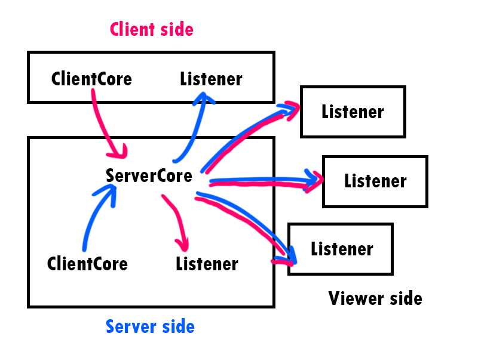
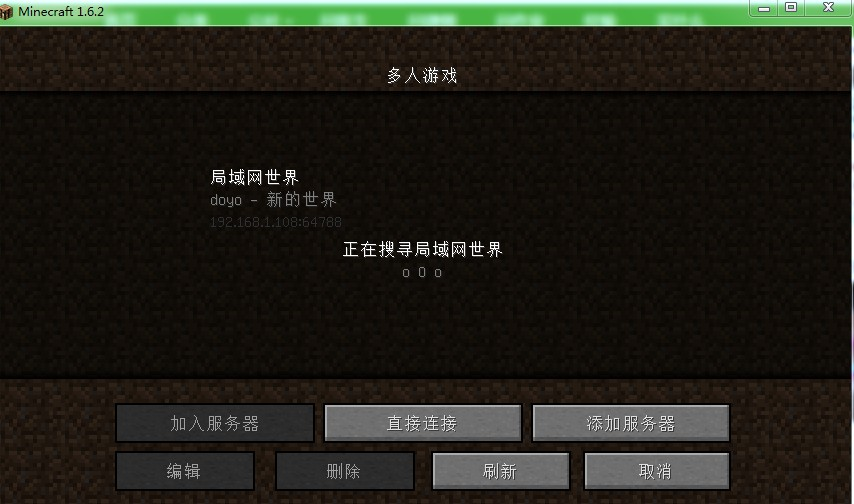

# ChessKing Presentation
* Over 10,000 lines of source code, 90 java files in total.
* Start from 2022.4.12, over half and a month of development
* Over 290 times of commitment on GitHub
## The Game Engine
### FXGL
A useful game engine which is a super set of JavaFX.

### Based on javafx
JavaFX offers full time support for MVC.

MVC (Mode-view-controller) divides the program logic into three interconnected elements. 
It emphasizes on the separation between a software's business logic and display.


Model: the data the app should contain.

View: how the app's data should be displayed.

Controller: the logic that updates the model and/or view in response to input from users.


***
## One Important Dream: Make a Complete Game
### Make Functions of the Game Complete

With all these functions we want to achieve, we can't just add so many buttons to the side of our 
chessboard with titles "Save" and "Replay". That makes our game look like a homework that is made 
to fulfill random requirements of teachers. 

That is why we made a complete UI for the main menu, and put all the buttons there. We think that 
makes a lot more sense than putting everything together with the chessboard.


### Make Rules of Chess Complete
The rules for the chess in our project is not so complete. It doesn't include "Draw by agreement", 
"Fifty-move rule", or "Surrender". So we added draw by agreement to our AI, so that you and him 
could shake hands peacefully and enjoy a win-win situation. You can also use the "Fifty-move rule" 
to force a draw game on your opponent, but we strongly doubt that anyone will do that. When you 
don't want to play a game, and your mind is on leaving, you don't even need to wait fifteen 
minutes to "Surrender".


### User Friendly
User Interface
* Choose different local players
* Players can change their name, avatar, skin, chessboard colour, and background
* Independent saves for different players
* Can delete players, saves, replays.

Game information display in game
* Targets of your chess
* Your allies 
* Your enemies
* Where to place your chess
* All the previous steps
* Checkmate notification


Save and replay function
* retract false move
* watch a played game
* play from where you left

Play remotely with LAN connection
* connect with friends around you in CS classes
* watch others play the game of chess


***
## AI Algorithms
### Minimax and Alpha-Beta pruning search
As is informed by the requirement, we use minimax search as well as Alpha-Beta pruning search to
implement our AI algorithms.


```java
//src/main/java/edu/sustech/chessking/gameLogic/ai/AiEnemy.java
public class AiEnemy {
    
    //alpha-beta pruning
    private int searchMax(int availableMax, int index) {
        //System.out.println("Search max with index " + index);
        int maxScore = negativeInfinite;
        ArrayList<Move> availableMove = gameCore.getAvailableMove();
        //ranking the moves from best to worst
        availableMove.sort((o1, o2) -> getScore(o2) - getScore(o1));

        int score;
        for (Move move : availableMove) {
            score = getMaxSearchScore(index, maxScore, move);
            if (score > availableMax) {
                return score;
            }
            maxScore = Math.max(maxScore, score);
        }
        return maxScore;
    }
}
```
### Difficulties
We set up three levels of AI:
* Easy: 2 search depth, no time limit
* Normal: 4 search depth, game time limit as 90 minutes
* Hard: 6 search depth, game time limit as 60 minutes


### Optimization
#### ranking

```
availableMove.sort((o1, o2) -> getScore(o2) - getScore(o1));
```
Calculate an approximate score for each move and rank them from high to low. 
This helps improve the pruning efficiency.

#### The end of searching tree
In order to reduce the chance of misjudging at the end of the searching tree,
we use a more complicated method calculate the score, like calculate the expected exchange score.

```java
//src/main/java/edu/sustech/chessking/gameLogic/ai/EvaluationMethod.java
public class EvaluationMethod {
    public static int getAccurateScore(Move move, GameCore gameCore) {
        /* other codes */
        
        int exchangeScore = 0;
        Chess enemyChess, allyChess = chess;
        int i = 0, j = 0;
        while (i < enemyList.size()) {
            enemyChess = enemyList.get(i);
            //if no chess to eat the enemyChess, or it is weaker, then eat
            if (j >= allyList.size() ||
                    getChessScore(enemyChess) <= getChessScore(allyChess))
                exchangeScore -= getChessScore(allyChess);
            else
                break;

            if (j >= allyList.size())
                break;
            allyChess = allyList.get(j);
            //If no enemy chess can eat, or allayChess is weaker, then eat
            if (i + 1 >= enemyList.size() ||
                    getChessScore(allyChess) <= getChessScore(enemyChess))
                exchangeScore += getChessScore(enemyChess);
            else
                break;
            ++i;
            ++j;
        }
        score += exchangeScore;

        /* other codes */
    }
}
```

### Multiply threads
Since at the highest level of AI needs time to do its calculation, put it in the 
FXMainThread will result in window no-response. Hence, we create a new thread for its calculation:

```java
//src/main/java/edu/sustech/chessking/ChessKingApp.java
public class ChessKingApp extends GameApplication {
    @Override
    protected void onUpdate(double tpf) {
        /* other codes */
        
        Thread thread = new Thread(() -> {
            Move move = ai.getNextMove();
            Entity chess = getChessEntity(
                    toPoint(move.getChess().getPosition()));
            if (chess == null)
                throw new RuntimeException("Cannot find chess!");
            chess.getComponent(ChessComponent.class).computerExecuteMove(move);
        });
        thread.setDaemon(true);
        thread.start();

        /* other codes */
    }
}
```

*** 
## Multiplayer
### Network Interface provided by FXGL
FXGL provides many useful interfaces for network, without which we have no way finish lan multi-playing.
In general, FXGL provides a Connection class which may add handler messages and send messages, 
with which we are able to build the multiplayer system.

```
//Create connection
var client = FXGL.getNetService().newTCPClient("localhost", 55555);
client.setOnConnected(connection -> {
    connection.addMessageHandlerFX((conn, message) -> {
          /* do something here */
    });
});

//add handler and send message
Connection<Bundle> connection = ...
connection.addMessageHandlerFX((conn, message) -> {
    /* do something here */
});

var data = new Bundle("");
data.put("key", "value");
connection.send(data);
```
### Structure
There are three main structure for net work: 
* ClientCore, responsible for sending message
* ServerCore, broadcast the received message to other listeners
* Listener,  listen the messages received from the server



### Abstract class for information receive
Since the interval from request from the server to receive the result is not instant, 
we use the abstract class to construct the listener logic, while what will happen after receiving messages
are left to the implements.

```java
//src/main/java/edu/sustech/chessking/gameLogic/multiplayer/GameEventListener.java
abstract public class GameEventListener {
    private final MessageHandler<Bundle> gameEventListener = (conn, msg) -> {
        if (msg.exists(PickUpChess))
            onPickUpChess(msg.get(PickUpChess));
        if (msg.exists(PutDownChess))
            onPutDownChess(msg.get(PutDownChess));
        if (msg.exists(MoveChess))
            onMoveChess(msg.get(MoveChess));
        if (msg.exists(EndTurn))
            onEndTurn(msg.get(EndTurn));
    };
    
    abstract protected void onPickUpChess(Chess chess);
    abstract protected void onPutDownChess(Position pos);

    abstract protected void onMoveChess(Move move);
    abstract protected void onEndTurn(double remainTime);
}
```


### Game Searching
We want the client can automatically search for any existing game within the lan. 
Here we mainly refer to Minecraft for the implements. (We even dig into the source code of Minecraft)



In short, the server will broadcast its IP and port to a non-existent address, 
which is 224.0.2.60:4444, and the client will search the address for any IP and port,
therefore the client can connect to the server.

```java
//src/main/java/edu/sustech/chessking/gameLogic/multiplayer/Lan/LanServerBroadcaster.java
public class LanServerBroadcaster extends Thread {
    private final DatagramPacket datagramSocket;
    private final DatagramSocket socket;

    public LanServerBroadcaster(String targetAddress) throws IOException {
        byte[] bs = targetAddress.getBytes(StandardCharsets.UTF_8);
        socket = new DatagramSocket();
        InetAddress inetAddress = InetAddress.getByName(LanProtocol.Address);
        datagramSocket = new DatagramPacket(bs,
                bs.length, inetAddress, LanProtocol.Port);
    }

    @Override
    public void run() {
        while (!this.isInterrupted()) {
            try {
                socket.send(datagramSocket);
            } catch (IOException ignored) {
            }
        }
    }
}

//src/main/java/edu/sustech/chessking/gameLogic/multiplayer/Lan/LanServerSearcher.java
abstract public class LanServerSearcher extends Thread{
    private final MulticastSocket socket;
    public LanServerSearcher() throws IOException {
        socket = new MulticastSocket(Port);
        socket.setSoTimeout(5000);
        socket.joinGroup(new InetSocketAddress(
                InetAddress.getByName(Address), 0), null);
    }

    @Override
    public final void run() {
        byte[] bs = new byte[1024];
        while (!this.isInterrupted()) {
            DatagramPacket datagramPocket = new DatagramPacket(bs, bs.length);
            try {
                socket.receive(datagramPocket);
            } catch (SocketTimeoutException e) {
                //Search time out
                continue;
            } catch (IOException e) {
                onFailToSearch("Couldn't ping server");
                break;
            }
        }
    }
}
```

***
## Regrets
### Poor code reuse
Later I found that many of the sub-scenes inside the UI design package can actually inherit from a 
more general parent. For example, the ChooseLocalPlayer, ChoosePlayer2, LoadSave, LoadReplay, DeleteSave, 
DeletePlayer and DeleteReplay sub-scenes all have the same basic view elements consisting of a grey background,
a linear-gradient window, a title, a list in the middle, and some buttons at the bottom. 

We should have written a big ChooseSomething sub scene to be the parent of all these subscenes. That would 
have made my work as a UI designer much easier. I could also have spent less time on wrtting a same 
background for each of my sub scene.


### Poor code structure
Especially the classes that are written in the early process of the project,
the structure is rather a mixture, and I put a large bundle of if-else just in order to make it work.
This results in many diffuse classes, such as the GameCore.java, it has over 1100 lines of codes, 
which make it difficult for reconfiguration. One may notice that we use a single Chess class and
ChessType enum type to represent different chess. I have to admit this is one of the worst failure in
the project, since it make the code much harder to maintain, compared to the interface-inherit implement.

### Lack of testing
Although we have spent a lot of time debugging, many of which are found in the process of actually playing.
Looking back, we should have designed a test class for each function we add. 
This is also the common practise in development.
