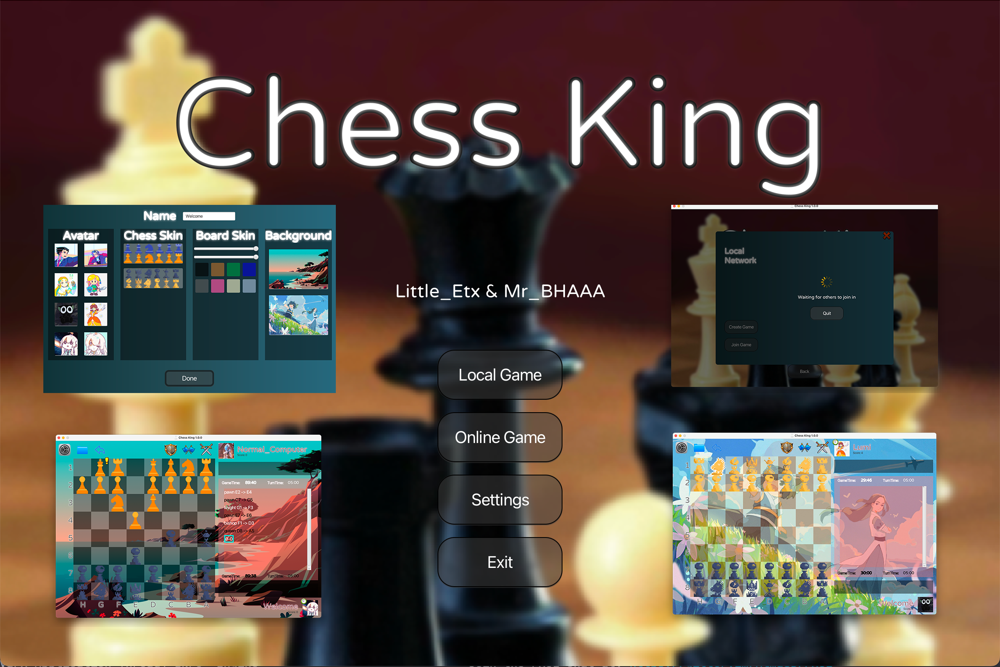
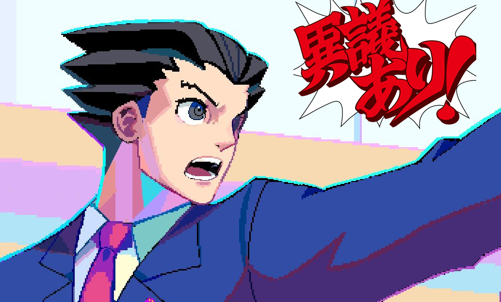
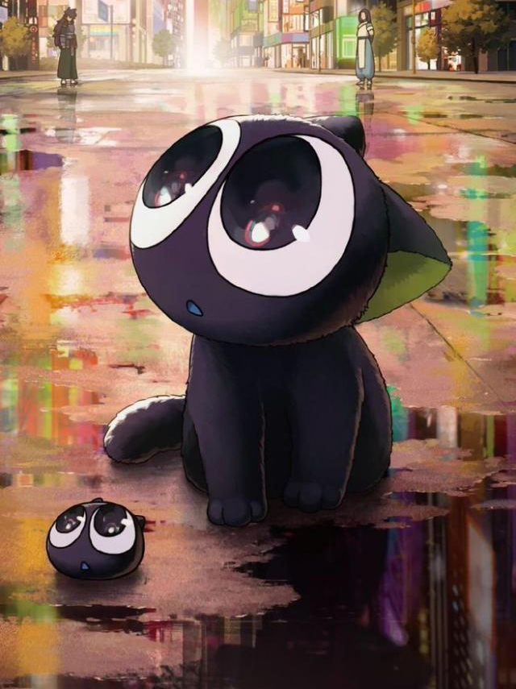
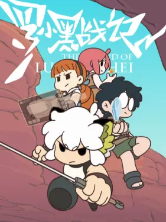
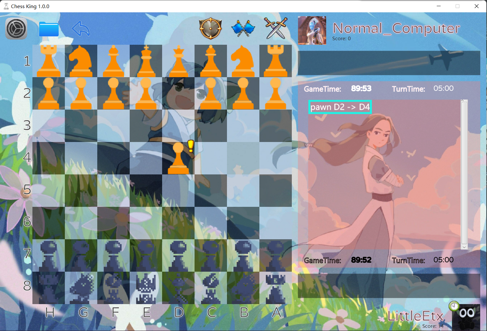

# Chess King
A chess game based on javafx and [FXGL](https://github.com/AlmasB/FXGL)

## Authors
*  **LittleEtx** (Li Tian) Mastermind for logics and coding. Big boss.
*  **MrBHAAA** (Zhang Luming) Servant for Boss Li, ugly UI design.

## Operation
Click your mouse to move the chess, and gain victory over your friends
or computers.

Guides towards chess can be found here: 
* [Wikipedia Guide for Chess](https://en.wikipedia.org/wiki/Chess)
* [Human losing to Computers](https://www.bilibili.com/video/BV17B4y117fd?share_source=copy_web)

Have fun ~ 🥳

(<a href="#top">back to top</a>)

## Some Funny Details 

### The Leader Board
The leader board can be found where you are choosing a player 
for the local game. Points will only be gained by winning games 
against computers, which we think is a really hard-to-achieve 
goal. You can access the leader board by clicking the little trophy
on the top left side when you are choosing a player.

### Deleting a Player
You can delete a player by clicking the small, hard-to-find, little
grey button to the left of the trophy.

### Background Music
Background music is different when you are in different stages of 
the game. When you are in the main menu, the background music is the
 main theme for [Animal Crossing](https://animal-crossing.com) from Nintendo. Which will make the 
ones who played this game have a liver-ache.

The music in the main game is from [Ace Attorney](https://www.ace-attorney.com) by Capcom. Making anyone
who play this game extra excited and scream out "OBJECTION!".

### A Nintendo and Capcom Fan
MrBHAAA is a great fan of Nintendo, so he put a lot of Nintendo stuff
into this game. Including but not limited to avatars of Princess Zelda 
and Link from [the Legend of Zelda](https://www.zelda.com/), Princess 
Daisy from [the Mario Franchise](https://mario.nintendo.com/characters/);
the background music of [Animal Crossing](https://animal-crossing.com).

There are also a lot of [Ace Attorney](https://www.ace-attorney.com) 
elements in this game. Including the avatar of [Phoenix Wright](https://aceattorney.fandom.com/wiki/Phoenix_Wright) shouting
["OBJECTION!!!"](https://aceattorney.fandom.com/wiki/Objection!), and 
[Miles Edgeworth](https://aceattorney.fandom.com/wiki/Miles_Edgeworth) looking defeated.

### A Hand-drawn Skin
The pixel skin inside the game is hand-drawn by MrBHAAA. It is in pixel 
because MrBHAAA's favourite game are pixel games. He believes that 
pixel art is an art that can find the essence of an object. He also likes 
playing [Dead Cells](https://dead-cells.com), so it kinda looks like that.

### Dead Fan of the Legend of Hei
LittleEtx is dead fan of [the Legend of Hei](https://www.bilibili.com/bangumi/media/md1733/),
and he owns a lot of its animation derivatives.

Now that LittleEtx has acquired the chance of making his own game,
he won't miss the chance to bring his beloved cat into it.
In game, player can choose either the avatar of Hei or a pretty wallpaper
of Hei and his master ShiFu. What a joy playing chess with Hei's accompany!

(<a href="#top">back to top</a>)

## Known Bugs
Some strange things might happen when you guys are trying to play
the local Lan game between computers with different systems (e.g. Mac 
vs. Windows || Windows10 vs. Windows7).

This is only a small project for our CS102A class, so we didn't really
spend a lot of work debugging. There might be more bugs, and we might
 have the time to actually fix them. Feel free to contact us through
the servant's email (12112618@mail.sustech.edu.cn) .

(<a href="#top">back to top</a>)

## Contributions
Most of the pictures are found on 
* [a free resource sharing website](https://www.aigei.com)
* [Wikipedia](https://en.wikipedia.org/wiki/Chess)

Music is found in bilibili videos
* [PhoenixWright](https://www.bilibili.com/video/BV17s411i7Qt?share_source=copy_web)
* [Animal Crossing](https://www.bilibili.com/video/BV14E411P7uc?share_source=copy_web)

One chess skin comes from 
* [Chess game demo](https://github.com/DiDicpR/ChessDemoForCS102A)

Some textures come from
* [https://www.aigei.com](https://www.aigei.com)

A lot of the pictures of buttons and backgrounds in the game are directly from apple, because MrBHAAA is a 
super apple fan. So thank you Apple!

(<a href="#top">back to top</a>)

